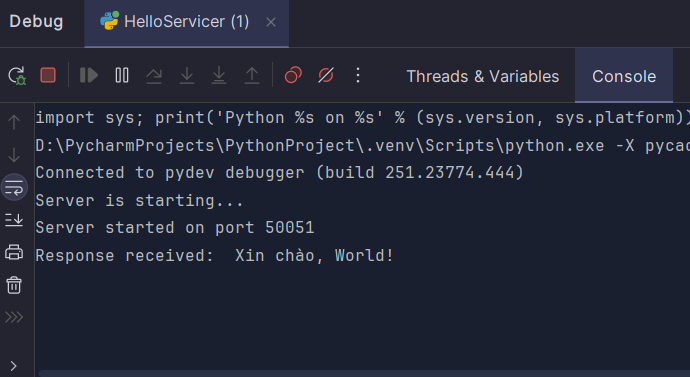

# gRPC Hello World

Đây là một ví dụ đơn giản về cách sử dụng **gRPC** trong Python để xây dựng một server và client. Dự án bao gồm hai phần chính:

1. **gRPC Server**: Xử lý các yêu cầu từ client và gửi phản hồi.
2. **gRPC Client**: Gửi yêu cầu tới server và nhận phản hồi.

## Cấu trúc Dự án

```css
grpc-json-demo/
│
├── hello_pb2.py          # Tập tin chứa các định nghĩa proto (generated code)
├── hello_pb2_grpc.py     # Tập tin chứa stub và các phương thức gRPC (generated code)
└──HelloServicer.py      # Tập tin server (gRPC server và client)
```


## Yêu Cầu

Trước khi chạy ứng dụng, bạn cần cài đặt các phụ thuộc sau:

- Python 3.x
- grpcio
- grpcio-tools

## Cài đặt

### 1. Cài đặt các thư viện cần thiết:

```bash
pip install grpcio grpcio-tools
```
--- 
### 2. Tạo các file hello_pb2.py và hello_pb2_grpc.py từ file .proto của bạn:

```bash
python -m grpc_tools.protoc -I. --python_out=. --grpc_python_out=. hello.proto
```
---

## Cách sử dụng
### 1. Chạy Server
   Chạy file HelloServicer.py để khởi tạo server gRPC:
```bash
python HelloServicer.py
```
Server sẽ khởi động và lắng nghe các yêu cầu ở cổng `50051`.

---

### 2. Gửi Yêu Cầu từ Client
File `HelloServicer.py` cũng bao gồm client. Sau khi server được khởi động, client sẽ gửi yêu cầu "SayHello" đến server và nhận phản hồi.

Client sẽ in ra thông báo như sau:
```yaml
Response received: Xin chào, World!
```

---

### 3. Lỗi thường gặp
   - Lỗi `Port 50051 is already in use`: Kiểm tra xem cổng `50051` có đang được sử dụng không bằng cách sử dụng lệnh `netstat` hoặc khởi động lại máy tính.
   - Lỗi không tìm thấy file `hello_pb2.py`: Đảm bảo bạn đã chạy đúng lệnh `protoc` để tạo các file Python từ file `.proto`.