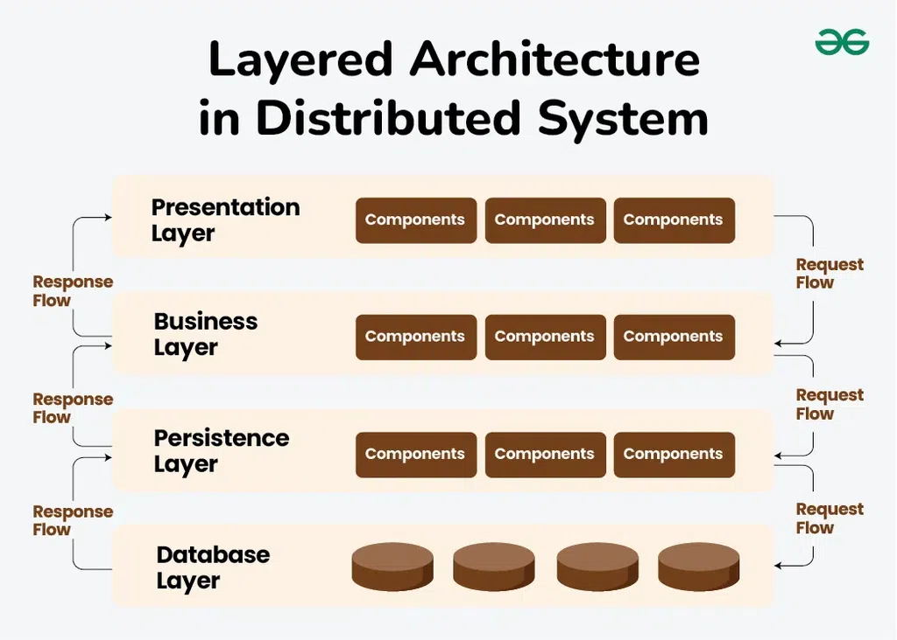

# **Hệ Thống Phân Tán**

> **Nhóm 16 - Hệ thống phân tán**  
> - Trần Bá Minh Đức – `23010210`  
> - Đồng Đạo Minh Dũng – `22010299`  
>   
> **Ngày thực hiện:** 28/04/2025

---

## 1. Hệ thống phân tán là gì?

**Hệ thống phân tán** (Distributed System) là tập hợp nhiều máy tính độc lập, được kết nối thông qua mạng và phối hợp hoạt động như **một hệ thống duy nhất** đối với người dùng cuối.  

Người dùng không cần biết phía sau có bao nhiêu máy, cách các máy vận hành hay phân chia dữ liệu ra sao — **trải nghiệm được thống nhất và liền mạch** như chỉ đang sử dụng một hệ thống.

## 2. Các ứng dụng nổi bật của hệ thống phân tán

- **Dịch vụ đám mây**: AWS, Google Cloud, Microsoft Azure
- **Mạng xã hội**: Facebook, Instagram, Twitter
- **Ứng dụng chia sẻ tệp tin**: Dropbox, Google Drive
- **Thương mại điện tử**: Shopee, Lazada, Amazon
- **Streaming đa phương tiện**: Netflix, Spotify, YouTube
- **Blockchain và tiền mã hóa**: Bitcoin, Ethereum

## 3. Các khái niệm cốt lõi

Hệ thống phân tán vận hành dựa trên các nguyên lý quan trọng:

| Thuật ngữ | Giải thích ngắn gọn |
|:---------|:--------------------|
| **Scalability** (Khả năng mở rộng) | Khả năng tăng sức mạnh xử lý khi tải tăng lên. |
| **Fault Tolerance** (Khả năng chịu lỗi) | Tiếp tục hoạt động ngay cả khi một số thành phần hỏng hóc. |
| **Availability** (Khả dụng) | Luôn sẵn sàng phục vụ người dùng bất cứ lúc nào. |
| **Transparency** (Tính trong suốt) | Che giấu sự phức tạp hệ thống đối với người dùng. |
| **Concurrency** (Tính đồng thời) | Nhiều người dùng truy cập tài nguyên cùng lúc mà không xung đột. |
| **Parallelism** (Tính song song) | Thực hiện nhiều tác vụ đồng thời để tăng hiệu suất. |
| **Openness** (Tính mở) | Tuân theo tiêu chuẩn mở, dễ dàng mở rộng và tích hợp. |
| **Vertical Scaling** (Mở rộng chiều dọc) | Nâng cấp phần cứng của máy chủ hiện có. |
| **Horizontal Scaling** (Mở rộng chiều ngang) | Thêm nhiều máy chủ để tăng khả năng xử lý. |
| **Load Balancer** (Bộ cân bằng tải) | Phân phối lưu lượng đồng đều giữa các máy chủ. |
| **Replication** (Nhân bản) | Sao lưu dữ liệu ở nhiều nơi để tăng an toàn và tốc độ truy cập. |

## 4. Ví dụ thực tế

### **Netflix và hệ thống phân tán**

Netflix vận hành một trong những hệ thống phân tán lớn nhất thế giới, phục vụ hàng triệu người dùng.

- **Scalability**: Mở rộng hệ thống vào giờ cao điểm hoặc ngày lễ.
- **Fault Tolerance**: Tự động chuyển đổi sang máy chủ khác khi gặp lỗi.
- **Availability**: Người dùng có thể xem phim mọ i lúc, mọ i nơi.
- **Transparency**: Người dùng không cần biết phim được lưu ở đâu.
- **Concurrency**: Hàng triệu người xem cùng lúc mà không gián đoạn.
- **Parallelism**: Video được tải đồng thời từ nhiều server để giảm thời gian chờ.
- **Openness**: Dùng chuẩn HTTP, TCP/IP để hỗ trợ nhiều nền tảng.
- **Vertical Scaling**: Tăng cường phần cứng máy chủ quan trọng.
- **Horizontal Scaling**: Mở rộng số lượng server ở nhiều khu vực.
- **Load Balancer**: Phân phối truy cập hợp lý đến các server.
- **Replication**: Sao lưu phim hot tại nhiều data center.

## 5. Các mô hình kiến trúc phổ biến

| Lớp (Layer) | Mô tả | Ví dụ |
|:------------|:------|:------|
| **Presentation Layer** | Giao diện người dùng; nơi nhận yêu cầu từ người dùng và hiển thị kết quả. | Website frontend, Mobile app UI |
| **Business Layer** | Xử lý logic nghiệp vụ; thực hiện các quy tắc, quy trình của hệ thống. | Xử lý đặt hàng, xác thực người dùng |
| **Persistence Layer** | Quản lý giao tiếp với cơ sở dữ liệu; trung gian giữa logic và dữ liệu. | ORM (Hibernate, JPA), Repository pattern |
| **Database Layer** | Lưu trữ dữ liệu thực tế trong hệ thống; thực hiện truy vấn và cập nhật dữ liệu. | MySQL, MongoDB, PostgreSQL |

## 6. Ví dụ kiến trúc thực tế

### **Hệ thống Shopee**

- **Client-Server**: Ứng dụng Shopee gửi yêu cầu đến server Shopee.
- **Multi-Tier**: Frontend (ứng dụng) → Backend (API) → Database.
- **Microservices**: Các dịch vụ như tìm kiếm, thanh toán, vận chuyển hoạt động riêng biệt.
- **Load Balancer**: Điều phối yêu cầu đến nhiều server để tránh quá tải.
- **Replication**: Dữ liệu đơn hàng được nhân bản tại nhiều trung tâm dữ liệu.
- **Scalability**: Vào các ngày sale lớn (11/11, 12/12), Shopee tự động mở rộng hệ thống để phục vụ lượng truy cập tăng vọt.

## **Tổng kết**

> Hệ thống phân tán là nền tảng quan trọng cho mọi dịch vụ quy mô lớn hiện nay. Nhờ khả năng mở rộng linh hoạt, chịu lỗi tốt và khả dụng cao, chúng ta có thể truy cập thông tin và dịch vụ nhanh chóng, đáng tin
