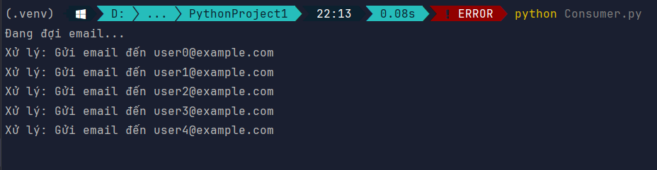
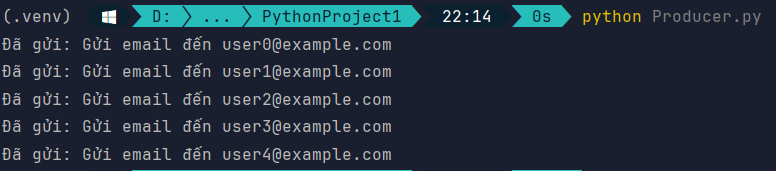

# Email Queue System using RabbitMQ 📨

Một hệ thống đơn giản sử dụng RabbitMQ để gửi và xử lý email thông qua mô hình Producer-Consumer bằng Python.

---

## 🚀 Mục tiêu

- Sử dụng RabbitMQ để gửi và nhận dữ liệu giữa các tiến trình.
- Tách biệt rõ ràng giữa producer (gửi email) và consumer (xử lý email).
- Thực hành kiến trúc hàng đợi sử dụng thư viện `pika`.

---

## 📦 Yêu cầu

- Python 3.x
- Docker (để chạy RabbitMQ)
- Thư viện Python: `pika`

Cài đặt thư viện:
```bash
pip install pika
```

---

## 🐳 Bước 1: Khởi động RabbitMQ bằng Docker

```bash
docker run -d --name rabbitmq \
  -p 5672:5672 -p 15672:15672 \
  rabbitmq:management
```

Truy cập giao diện web tại: [http://localhost:15672](http://localhost:15672)  
Tài khoản mặc định:

- Username: `guest`
- Password: `guest`

---

## ▶️ Bước 2: Chạy thử

1. **Mở Terminal 1** → chạy `Consumer.py`
```bash
python Consumer.py
```
→ Debug: 

2. **Mở Terminal 2** → chạy `Producer.py`
```bash
python Producer.py
```

Bạn sẽ thấy producer gửi các thông điệp và consumer xử lý chúng ngay lập tức.

---

## 📚 Tham khảo

- [RabbitMQ Management UI](http://localhost:15672)
- [pika documentation](https://pika.readthedocs.io/en/stable/)

---

## 🧹 Dọn dẹp

Sau khi xong, bạn có thể dừng container RabbitMQ bằng:

```bash
docker stop rabbitmq && docker rm rabbitmq
```

---

## 📬 Kết luận

Đây là một ví dụ đơn giản giúp bạn hiểu rõ cách hoạt động của RabbitMQ trong các hệ thống phân tán. Bạn có thể mở rộng nó thành hệ thống gửi mail thực tế, xử lý nền bằng worker, hoặc tích hợp với các microservice khác.
